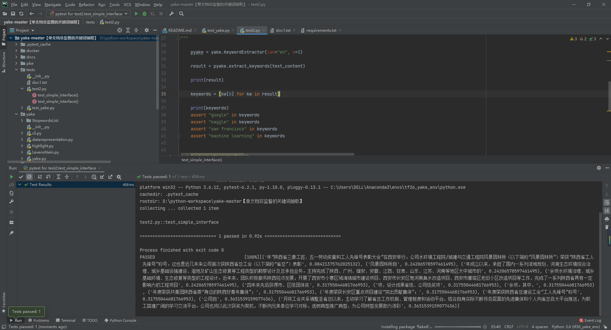

# yake-master
单文档非监督的关键词抽取

(tf36_yake_env) C:\Users\DELL>pip list
Package            Version
------------------ -------------------
atomicwrites       1.4.0
attrs              20.3.0
certifi            2020.12.5
click              7.1.2
colorama           0.4.4
decorator          4.4.2
importlib-metadata 3.3.0
iniconfig          1.1.1
jellyfish          0.8.2
networkx           2.5
numpy              1.19.4
object-detection   0.1
packaging          20.8
pip                20.3.3
pluggy             0.13.1
py                 1.10.0
pyparsing          2.4.7
pytest             6.2.1
regex              2020.11.13
segtok             1.5.10
setuptools         51.0.0.post20201207
tabulate           0.8.7
toml               0.10.2
typing-extensions  3.7.4.3
wheel              0.36.2
wincertstore       0.2
yake               0.4.3
zipp               3.4.0

(tf36_yake_env) C:\Users\DELL>python
Python 3.6.12 |Anaconda, Inc.| (default, Sep  9 2020, 00:29:25) [MSC v.1916 64 bit (AMD64)] on win32
Type "help", "copyright", "credits" or "license" for more information.
>>>   

=========================================================================

